# Svelte App Kit for Ruby on Rails

<div align="center">
  
</div>

This is a start app kit template analogous to Jumpstart Pro or BulletTrain, but using Svelte and Inertia.js for the frontend, with Ruby on Rails as the backend, and including a number of other useful libraries and tools.

## Features

- **[Svelte 5](https://svelte.dev/)** - A modern JavaScript framework for building user interfaces.
- **[Ruby on Rails](https://rubyonrails.org/)** - A powerful web application framework for building server-side applications.
- **[Inertia.js Rails](https://inertia-rails.dev/)** - Enables single-page applications using classic Rails routing and controllers.
- **[ShadcnUI](https://ui.shadcn.com/)** - A collection of UI components for Svelte.
- **[Tailwind CSS](https://tailwindcss.com/)** - A utility-first CSS framework for building custom designs.
- **[Phosphor Icons](https://phosphoricons.com/)** - A versatile icon library for user interfaces.
- **[JS Routes](https://github.com/railsware/js-routes)** - A library for generating JavaScript routes in Rails applications.
- **Rails Authentication** - Built-in authentication using the default Rails 8 authentication system.
- **[Vite](https://vitejs.dev/)** - A fast and modern frontend bundler.
- **[PostgreSQL](https://www.postgresql.org/)** - A powerful, open-source relational database system.
- **[DaisyUI](https://daisyui.com/)** - A plugin for Tailwind CSS that provides a set of pre-designed components, for rapid prototyping of components not covered by ShadcnUI.
- **[Claude Code Ready](https://www.anthropic.com/news/claude-code)** - Clear documentation in `/docs/` to enable Claude Code to perform at its best.
- **[SolidQueue/Cable/Cache](https://medium.com/@reinteractivehq/rails-8-solid-trifecta-comparison-44a76cb92ac3)** - Set up in development environment, for background jobs, real-time features, and caching.
- **[Obfuscated IDs](https://github.com/bullet-train-co/bullet_train-core/blob/3c12343eba5745dbe0f02db4cb8fb588e4a091e7/bullet_train-obfuscates_id/app/models/concerns/obfuscates_id.rb)** - For better security and aesthetics in URLs. Copy implementation from BulletTrain.
- **Testing** - Full test suite setup with [Playwright Component Testing](https://testomat.io/blog/playwright-component-testing-as-modern-alternative-to-traditional-tools/) for page testing, [Vitest](https://vitest.dev/) for Svelte component unit testing, [Minitest](https://guides.rubyonrails.org/testing.html) for Rails model and controller testing.
- **[Full-featured user system](https://jumpstartrails.com/docs/accounts)** - Necessary for most commercial applications, but not included in the default user setup.
    - [x] User signup and confirmation
    - [x] Personal/Organization Accounts
    - [x] Site Admin
    - [x] User Profiles
    - [x] Invitations
    - [x] Roles
- **Svelte Object Synchronization** - Using ActionCable and Inertia's partial reload and a custom Regitry to keep Svelte $props up to date in real-time.

## Target features (TODO)

- Audit Logging with audit log viewer (required in many business applications).
- **[Discard gem](https://github.com/jhawthorn/discard): Never delete anything important (e.g. accounts, users, etc), only discard it.
- MultiAttachment system supporting:
    - Direct uploads to S3
    - PDF/Document parsing
    - URL fetch
    - Free text
- AI Integration features:
    - OpenRouter integration
    - Prompt system
    - Basic Conversation System
    - Agentic Conversation System
- Organisation account settings:
    - Logo
    - Company Name
- All account settings:
    - Billing
- API capability:
    - API key management
    - API key usage tracking
    - API key rate limiting
    - API key billing
    - API key audit logging
    - API documentation

## Explicitly out of scope

- Internationalization (i18n)

## Installation

1. Click "Use this template" to create a new repository from this template.
2. Clone your new repository:
   ```sh
   git clone https://github.com/<youruser>/<your_repo>
   cd <your-repo>
   ```
3. Install dependencies:
   ```sh
   bundle install
   npm install
   ```
4. Setup the database:
   ```sh
   rails db:create:all
   rails db:setup db:prepare
   rails db:migrate:cache db:migrate:queue db:migrate:cable
   rails db:schema:dump:cable db:schema:dump:cache db:schema:dump:queue
   ```
   Check that the solid* databases have been created by checking `db/cable_schema.rb`, `db/cache_schema.rb`, and `db/queue_schema.rb` and seeing that they contain a comment at the top about auto-generation.
5. Either download the `config/master.key` from a colleague, or `rails credentials:edit` and add the following credentials:
    ```yaml
    aws:
      access_key_id: ...
      s3_bucket: ...
      s3_region: ...
      secret_access_key: ...

    ai:
      claude:
        api_token: ...
      open_ai:
        api_token: ...
      openrouter:
        api_token: ...

    honeybadger:
      api_key: ...
    ```
6. Start the development server:
   ```sh
   bin/dev
   ```
7. Open in browser at localhost:3100

### Optional: Claude setup

Necessary for Claude Code to be full featured.

```sh
claude mcp add --scope=local playwright npx @executeautomation/playwright-mcp-server
claude mcp add --scope=local snap-happy npx @mariozechner/snap-happy
```

## Usage

This template integrates Svelte with Rails using Inertia.js to manage front-end routing while keeping Rails' backend structure. It uses Vite for asset bundling, and all frontend code is located in the `app/frontend` directory. Place assets such as images and fonts inside the `app/frontend/assets` folder.

## Contributing

Feel free to fork this repository and submit pull requests with improvements, fixes, or additional features.

## Documentation

### Real-time Synchronization System

This application includes a powerful real-time synchronization system that automatically updates Svelte components when Rails models change, using ActionCable and Inertia.js partial reloads.

#### How It Works

1. Rails models broadcast minimal "marker" messages when they change
2. Svelte components subscribe to these broadcasts via ActionCable
3. When a broadcast is received, Inertia performs a partial reload of just the affected props
4. Updates are debounced (300ms) to handle multiple rapid changes efficiently

#### Key Files

**Rails Side:**
- [`app/channels/sync_channel.rb`](https://github.com/danieltenner/helix_kit/blob/master/app/channels/sync_channel.rb) - ActionCable channel with authorization
- [`app/models/concerns/broadcastable.rb`](https://github.com/danieltenner/helix_kit/blob/master/app/models/concerns/broadcastable.rb) - Model concern for automatic broadcasting
- [`app/models/concerns/sync_authorizable.rb`](https://github.com/danieltenner/helix_kit/blob/master/app/models/concerns/sync_authorizable.rb) - Authorization logic for sync access
- [`app/channels/application_cable/connection.rb`](https://github.com/danieltenner/helix_kit/blob/master/app/channels/application_cable/connection.rb) - WebSocket authentication

**JavaScript/Svelte Side:**
- [`app/frontend/lib/cable.js`](https://github.com/danieltenner/helix_kit/blob/master/app/frontend/lib/cable.js) - Core ActionCable subscription management
- [`app/frontend/lib/use-sync.js`](https://github.com/danieltenner/helix_kit/blob/master/app/frontend/lib/use-sync.js) - Svelte hook for easy integration

#### Usage Example

**1. Add to your Rails model:**
```ruby
class Account < ApplicationRecord
  include SyncAuthorizable
  include Broadcastable
  
  # Configure what to broadcast to
  broadcasts_to :all  # Broadcast to admin collection (for index pages)
end

class AccountUser < ApplicationRecord
  include Broadcastable
  
  belongs_to :account
  belongs_to :user
  
  # Broadcast changes to the parent account
  broadcasts_to :account
end

class User < ApplicationRecord
  include Broadcastable
  
  has_many :accounts
  
  # Broadcast changes to all associated accounts (uses Rails reflection)
  broadcasts_to :accounts
end
```

**Understanding `broadcasts_to`:**
- `:all` - Broadcasts to a collection channel (typically for admin index pages)
- Association name - Broadcasts to associated records automatically:
  - For `belongs_to`/`has_one`: Broadcasts to the single associated record
  - For `has_many`/`has_and_belongs_to_many`: Broadcasts to each record in the collection
- Rails uses reflection to automatically detect the association type and handle it correctly

**2. Use in your Svelte component:**

For static subscriptions:
```svelte
<script>
  import { useSync } from '$lib/use-sync';
  
  let { accounts = [] } = $props();
  
  // Simple static subscriptions
  useSync({
    'Account:all': 'accounts',  // Updates when any account changes
  });
</script>
```

For dynamic subscriptions (when the subscribed objects can change):
```svelte
<script>
  import { createDynamicSync } from '$lib/use-sync';
  
  let { accounts = [], selected_account = null } = $props();
  
  // Create dynamic sync handler
  const updateSync = createDynamicSync();
  
  // Update subscriptions when selected_account changes
  $effect(() => {
    const subs = { 'Account:all': 'accounts' };
    if (selected_account) {
      subs[`Account:${selected_account.id}`] = 'selected_account';
    }
    updateSync(subs);
  });
</script>
```

That's it! Your component will now automatically update when the data changes on the server.

#### Complete Example: Controller + Model + Component

Here's how all the pieces work together:

**Rails Controller:**
```ruby
# app/controllers/dashboard_controller.rb
class DashboardController < ApplicationController
  def index
    render inertia: "Dashboard", props: {
      current_user: current_user.as_json,
      account: current_account.as_json,
      notifications: current_user.notifications
    }
  end
end
```

**Rails Models:**
```ruby
# app/models/notification.rb
class Notification < ApplicationRecord
  include Broadcastable
  belongs_to :user
  
  # Broadcast changes to the parent user
  broadcasts_to :user
end

# app/models/user.rb  
class User < ApplicationRecord
  include Broadcastable
  has_many :accounts, through: :account_users
  
  # Broadcast changes to all associated accounts
  broadcasts_to :accounts
end
```

**Svelte Component:**
```svelte
<script>
  import { useSync } from '$lib/use-sync';
  
  // These prop names match what the controller sends
  let { current_user, account, notifications } = $props();
  
  // Subscribe to updates - map channels to props to reload
  useSync({
    [`User:${current_user.id}`]: 'current_user',
    [`Account:${account.id}`]: 'account',
    [`Notification:all`]: 'notifications'
  });
</script>
```

The key insight: The model just broadcasts its identity (e.g., "User:123"), and the Svelte component decides which props need reloading based on its subscriptions.

#### Authorization Model

- Objects with an `account` property: Accessible by all users in that account
- Objects without an `account` property: Admin-only access
- Site admins can subscribe to `:all` collections for any model

#### Testing

Run the synchronization tests:
```sh
rails test test/channels/sync_channel_test.rb
rails test test/models/concerns/broadcastable_test.rb
```

See the [in-app documentation](/documentation) for more detailed information and advanced usage.

### JSON Serialization with json_attributes

This application includes a powerful convention for controlling how Rails models are serialized to JSON, with automatic ID obfuscation for better security and cleaner URLs.

#### How It Works

The `json_attributes` concern provides a declarative way to specify which attributes and methods should be included when a model is converted to JSON (for Inertia props or API responses). It also automatically obfuscates model IDs using `to_param`.

#### Key Features

1. **Declarative Attribute Selection** - Explicitly define which attributes/methods to include
2. **Automatic ID Obfuscation** - IDs are automatically replaced with obfuscated versions via `to_param`
3. **Boolean Key Cleaning** - Methods ending with `?` have the `?` removed in JSON (e.g., `admin?` becomes `admin`)
4. **Association Support** - Include associated models with their own json_attributes
5. **Context Propagation** - Pass context (like `current_user`) through nested associations

#### Usage Example

```ruby
class User < ApplicationRecord
  include JsonAttributes
  
  # Specify what to include in JSON, excluding sensitive fields
  json_attributes :full_name, :site_admin, except: [:password_digest]
end

class Account < ApplicationRecord
  include JsonAttributes
  
  # Include boolean methods (the ? will be stripped in JSON)
  json_attributes :personal?, :team?, :active?, :is_site_admin, :name
end

class AccountUser < ApplicationRecord
  include JsonAttributes
  
  # Include associations with their json_attributes
  json_attributes :role, :confirmed_at, include: { user: {}, account: {} }
end
```

#### In Controllers

```ruby
class AccountsController < ApplicationController
  def show
    @account = current_user.accounts.find(params[:id])
    
    render inertia: "accounts/show", props: {
      # as_json automatically uses json_attributes configuration
      account: @account.as_json,
      # Pass current_user context for authorization in nested associations
      members: @account.account_users.as_json(current_user: current_user)
    }
  end
end
```

#### Benefits

- **Security**: Sensitive attributes like `password_digest` are never accidentally exposed
- **Clean URLs**: Obfuscated IDs provide better aesthetics and security
- **Consistency**: All models serialize the same way throughout the application
- **Performance**: Only specified attributes are serialized, reducing payload size
- **Maintainability**: JSON structure is defined in one place (the model)

See the [in-app documentation](/documentation) for more detailed information and advanced usage.

## License

This project is open-source and available under the [MIT License](LICENSE).

