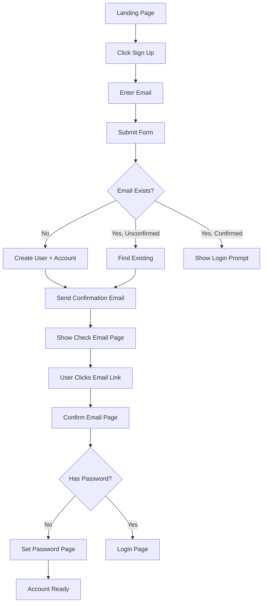

# Frontend Implementation Plan for Account Management System

## Executive Summary

This plan details the frontend implementation for the account management system in a Rails 8 + Svelte 5 + Inertia.js application. The implementation follows a minimal, user-friendly approach that seamlessly integrates account concepts without overwhelming users. The design prioritizes clarity in the registration flow, transparent account context display, and lays the foundation for future team account features while maintaining simplicity for personal accounts.

## Architecture Overview

### Core Principles
1. **Invisible Complexity**: Users don't need to understand "accounts" during signup
2. **Progressive Disclosure**: Account features revealed only when relevant
3. **Context Awareness**: Always clear which account context is active
4. **Future-Proof**: Structure supports team accounts without current UI complexity
5. **Inertia-First**: Leverage server-driven UI with selective client interactivity

### Data Flow
```
Rails Controller → Inertia Props → Svelte Component → User Interaction
                                         ↓
Rails Controller ← Inertia Request ← Form Submission
```

### State Management Strategy
- **Server State**: Account context managed in Rails session, passed via Inertia shared data
- **Component State**: Svelte 5 runes for local UI state
- **No Client Stores**: Avoid client-side account store initially, rely on Inertia props
- **Flash Messages**: Continue using existing toast system for feedback

## Component Structure

### Modified Components

#### 1. Signup Form Enhancement
**File**: `/app/frontend/lib/components/signup-form.svelte`
```svelte
<script>
  import { Button } from "$lib/components/ui/button/index.js";
  import * as Card from "$lib/components/ui/card/index.js";
  import { Input } from "$lib/components/ui/input/index.js";
  import { InputError } from "$lib/components/ui/input-error/index.js";
  import { Label } from "$lib/components/ui/label/index.js";
  import { Link, useForm } from "@inertiajs/svelte";
  import { signupPath, loginPath } from "@/routes";
  import { Info } from "phosphor-svelte";

  const form = useForm({
    email_address: null
  });

  function submit(e) {
    e.preventDefault();
    $form.post(signupPath());
  }
</script>

<Card.Root class="mx-auto max-w-sm w-full">
  <Card.Header>
    <Card.Title class="text-2xl">Sign up</Card.Title>
    <Card.Description>
      Enter your email to create an account. We'll send you a confirmation link.
    </Card.Description>
  </Card.Header>
  <Card.Content>
    <form onsubmit={submit}>
      <div class="grid gap-4">
        <div class="grid gap-2">
          <Label for="email_address">Email</Label>
          <Input 
            id="email_address" 
            type="email" 
            placeholder="m@example.com" 
            required 
            bind:value={$form.email_address} 
            disabled={$form.processing}
          />
          <InputError errors={$form.errors.email_address} />
        </div>
        
        <!-- Subtle account creation notice -->
        <div class="rounded-lg bg-muted/50 p-3 text-xs text-muted-foreground">
          <div class="flex gap-2">
            <Info size={14} class="mt-0.5 flex-shrink-0" />
            <span>We'll create a personal workspace for you to get started.</span>
          </div>
        </div>
        
        <Button type="submit" class="w-full" disabled={$form.processing}>
          {$form.processing ? 'Creating account...' : 'Create Account'}
        </Button>
      </div>
      <div class="mt-4 text-center text-sm">
        Already have an account?
        <Link href={loginPath()} class="underline"> Log in </Link>
      </div>
    </form>
  </Card.Content>
</Card.Root>
```

#### 2. Navbar Account Context
**File**: `/app/frontend/lib/components/navbar.svelte`
Add account context display:
```svelte
<script>
  // ... existing imports ...
  
  const currentUser = $derived($page.props?.user);
  const currentAccount = $derived($page.props?.account);
</script>

<!-- In the user dropdown section -->
{#if currentUser}
  <DropdownMenu.Root>
    <DropdownMenu.Trigger class={cn(buttonVariants({ variant: 'outline' }), 'rounded-full px-2.5 gap-1')}>
      <List />
      <UserCircle />
    </DropdownMenu.Trigger>
    <DropdownMenu.Content class="w-56" align="end">
      <DropdownMenu.Group>
        <DropdownMenu.GroupHeading>
          <div class="text-xs font-normal text-muted-foreground">Account</div>
          <div class="text-sm font-semibold truncate">
            {currentAccount?.name || "Personal"}
          </div>
        </DropdownMenu.GroupHeading>
        <DropdownMenu.Separator />
        <DropdownMenu.GroupHeading>
          <div class="text-xs font-normal text-muted-foreground">Logged in as</div>
          <div class="text-sm font-semibold truncate">
            {currentUser.email_address}
          </div>
        </DropdownMenu.GroupHeading>
        <DropdownMenu.Separator />
        <DropdownMenu.Item onclick={handleLogout}>
          <SignOut class="mr-2 size-4" />
          <span>Log out</span>
        </DropdownMenu.Item>
      </DropdownMenu.Group>
    </DropdownMenu.Content>
  </DropdownMenu.Root>
{:else}
  <!-- ... existing logged out state ... -->
{/if}
```

### New Components

#### 3. Email Confirmation Component
**File**: `/app/frontend/pages/registrations/confirm-email.svelte`
```svelte
<script>
  import { page } from "@inertiajs/svelte";
  import * as Card from "$lib/components/ui/card/index.js";
  import Logo from "$lib/components/logo.svelte";
  import AuthLayout from "../../layouts/auth-layout.svelte";
  import { Spinner, CheckCircle, XCircle } from "phosphor-svelte";
  import { onMount } from "svelte";
  import { router } from "@inertiajs/svelte";
  
  let { token } = $props();
  let status = $state('confirming'); // 'confirming', 'success', 'error'
  let message = $state('Confirming your email...');
  
  onMount(() => {
    // Auto-confirm on mount
    confirmEmail();
  });
  
  async function confirmEmail() {
    try {
      // The actual confirmation happens via the controller
      // This component just displays the status
      if ($page.props.confirmation_status === 'success') {
        status = 'success';
        message = 'Email confirmed successfully!';
        // Redirect handled by controller
      } else if ($page.props.confirmation_status === 'error') {
        status = 'error';
        message = $page.props.error_message || 'Invalid or expired confirmation link.';
      }
    } catch (error) {
      status = 'error';
      message = 'An error occurred. Please try again.';
    }
  }
</script>

<AuthLayout>
  <div class="flex flex-col h-screen w-full items-center justify-center px-4">
    <Link href="/" class="mb-8">
      <Logo class="h-8 w-48" />
    </Link>
    
    <Card.Root class="mx-auto max-w-sm w-full">
      <Card.Header class="text-center">
        <div class="flex justify-center mb-4">
          {#if status === 'confirming'}
            <div class="rounded-full bg-blue-100 p-3">
              <Spinner size={32} class="text-blue-600 animate-spin" />
            </div>
          {:else if status === 'success'}
            <div class="rounded-full bg-green-100 p-3">
              <CheckCircle size={32} class="text-green-600" />
            </div>
          {:else}
            <div class="rounded-full bg-red-100 p-3">
              <XCircle size={32} class="text-red-600" />
            </div>
          {/if}
        </div>
        <Card.Title class="text-2xl">
          {#if status === 'confirming'}
            Confirming Email
          {:else if status === 'success'}
            Email Confirmed!
          {:else}
            Confirmation Failed
          {/if}
        </Card.Title>
        <Card.Description class="mt-2">
          {message}
        </Card.Description>
      </Card.Header>
    </Card.Root>
  </div>
</AuthLayout>
```

#### 4. Resend Confirmation Component
**File**: `/app/frontend/lib/components/resend-confirmation.svelte`
```svelte
<script>
  import { Button } from "$lib/components/ui/button/index.js";
  import { useForm } from "@inertiajs/svelte";
  import { resendConfirmationPath } from "@/routes";
  import { RefreshCw } from "phosphor-svelte";
  
  let { email } = $props();
  let cooldown = $state(0);
  
  const form = useForm({
    email_address: email
  });
  
  function resend() {
    $form.post(resendConfirmationPath(), {
      onSuccess: () => {
        startCooldown();
      }
    });
  }
  
  function startCooldown() {
    cooldown = 60;
    const interval = setInterval(() => {
      cooldown--;
      if (cooldown <= 0) {
        clearInterval(interval);
      }
    }, 1000);
  }
</script>

<Button 
  variant="outline" 
  onclick={resend}
  disabled={$form.processing || cooldown > 0}
  class="w-full"
>
  <RefreshCw class="mr-2 size-4" />
  {#if cooldown > 0}
    Resend in {cooldown}s
  {:else if $form.processing}
    Sending...
  {:else}
    Resend confirmation email
  {/if}
</Button>
```

## Inertia.js Integration

### Shared Data Updates
Update `/app/controllers/application_controller.rb`:
```ruby
class ApplicationController < ActionController::Base
  include Authentication
  include AccountScoping
  
  inertia_share flash: -> { flash.to_hash }
  inertia_share do
    if authenticated?
      {
        user: Current.user.slice(:id, :email_address, :name),
        account: current_account&.slice(:id, :name, :account_type)
      }
    end
  end
  
  wrap_parameters false
end
```

### Props Structure for Each Page

#### Registration Pages
```ruby
# signup page
render inertia: "registrations/signup", props: {
  errors: errors_hash # if any
}

# check-email page
render inertia: "registrations/check-email", props: {
  email: masked_email # e.g., "j***@example.com"
}

# confirm-email page
render inertia: "registrations/confirm-email", props: {
  confirmation_status: 'success' | 'error',
  error_message: String # if error
}

# set-password page
render inertia: "registrations/set-password", props: {
  email: email_address
}
```

## User Flow Specifications

### Registration Flow


### Visual Feedback States

#### During Registration
- **Processing**: Button shows "Creating account..." with disabled state
- **Success**: Redirect to check-email page with success toast
- **Error**: Inline error messages under form fields

#### Email Confirmation
- **Pending**: Spinner animation with "Confirming your email..."
- **Success**: Green checkmark with redirect countdown
- **Failed**: Red X with error message and retry options

#### Account Context Display
- **Navbar**: Subtle account name in dropdown header
- **No Badge**: Don't show "Personal" badge initially
- **Future Ready**: Structure supports account switcher dropdown

## Implementation Steps

### Phase 1: Core Components (Day 1 Morning)
- [ ] Update signup form with account creation messaging
- [ ] Create resend confirmation component
- [ ] Update check-email page with resend functionality
- [ ] Create email confirmation page component
- [ ] Test component rendering and props

### Phase 2: Inertia Integration (Day 1 Afternoon)
- [ ] Update ApplicationController shared data
- [ ] Add account context to Inertia props
- [ ] Update navbar to display account context
- [ ] Test data flow from Rails to Svelte
- [ ] Verify account context updates on navigation

### Phase 3: User Flows (Day 2 Morning)
- [ ] Implement complete registration flow
- [ ] Add email confirmation handling
- [ ] Test password setup after confirmation
- [ ] Verify existing user re-registration handling
- [ ] Add proper error states and messaging

### Phase 4: Polish & Edge Cases (Day 2 Afternoon)
- [ ] Add loading states for all async operations
- [ ] Implement cooldown for resend confirmation
- [ ] Add email masking for privacy
- [ ] Test browser back button behavior
- [ ] Verify mobile responsiveness

### Phase 5: Testing (Day 3)
- [ ] Write Playwright tests for registration flow
- [ ] Test confirmation link expiration
- [ ] Verify account context persistence
- [ ] Test error recovery scenarios
- [ ] Performance testing with multiple accounts

## UI/UX Specifications

### Design Tokens
```css
/* Account Context Colors */
--account-badge-bg: hsl(var(--muted));
--account-badge-text: hsl(var(--muted-foreground));
--account-hover: hsl(var(--accent));
```

### Component Styling Guidelines
1. **Account Context**: Subtle, non-intrusive display
2. **Confirmations**: Clear success/error states with icons
3. **Forms**: Consistent with existing auth forms
4. **Feedback**: Use existing toast system for notifications
5. **Mobile**: Full-width forms, readable text, touch-friendly buttons

### Accessibility Considerations
- [ ] ARIA labels for account context
- [ ] Keyboard navigation for dropdown menus
- [ ] Screen reader announcements for state changes
- [ ] High contrast mode support
- [ ] Focus management after redirects

## Error Handling Strategy

### Client-Side Errors
```javascript
// Standardized error display
function displayError(error) {
  if (error.response?.data?.errors) {
    // Field-specific errors
    return error.response.data.errors;
  } else {
    // Generic error toast
    toast.error(error.message || "An error occurred");
  }
}
```

### Server-Side Errors
- **Validation Errors**: Display inline under form fields
- **System Errors**: Show toast with user-friendly message
- **Network Errors**: Display connection error with retry option
- **Session Errors**: Redirect to login with return URL

## Performance Optimizations

### Code Splitting
- Lazy load confirmation components (rarely used)
- Keep signup form in main bundle (frequently accessed)
- Defer account switcher component (future feature)

### Caching Strategy
- Cache account context in Inertia shared data
- Avoid redundant account queries
- Use Svelte's reactive system for UI updates

### Bundle Size Considerations
- Reuse existing UI components
- Avoid new dependencies
- Tree-shake unused Phosphor icons

## Migration Path

### For Existing Users
1. First login triggers account creation
2. Seamless experience - no action required
3. Account name defaults to email-based name
4. Can be renamed later in settings (future)

### Backwards Compatibility
- Existing sessions remain valid
- Old confirmation tokens still work
- No breaking changes to public APIs
- Gradual rollout possible with feature flags

## Future Enhancements

### Account Switcher (Phase 2)
```svelte
<!-- Future dropdown in navbar -->
<DropdownMenu.Item>
  <Building class="mr-2 size-4" />
  <span>Switch Account</span>
</DropdownMenu.Item>
```

### Team Invitations (Phase 3)
- Invitation acceptance flow
- Role selection during invite
- Email notifications for invites

### Account Settings (Phase 4)
- Rename account
- Delete account
- Transfer ownership
- Billing management

## Testing Strategy

### Component Tests
```javascript
// Example Playwright test
test('signup creates account', async ({ page }) => {
  await page.goto('/signup');
  await page.fill('[name="email_address"]', 'test@example.com');
  await page.click('button[type="submit"]');
  
  await expect(page).toHaveURL('/check-email');
  await expect(page.locator('text=Check Your Email')).toBeVisible();
});
```

### Integration Tests
- Full registration flow
- Confirmation link handling
- Account context persistence
- Error recovery scenarios

### Visual Regression Tests
- Account dropdown appearance
- Confirmation page states
- Form error states
- Mobile layouts

## Success Metrics

### User Experience
- [ ] Registration completion rate > 80%
- [ ] Email confirmation rate > 90%
- [ ] Time to account ready < 2 minutes
- [ ] Support tickets for registration < 1%

### Technical Metrics
- [ ] Page load time < 200ms
- [ ] Form submission < 500ms
- [ ] Zero client-side errors in production
- [ ] 100% test coverage for critical paths

## Notes and Considerations

### Security
- Never expose internal account IDs in URLs
- Validate account access on every request
- Rate limit confirmation email resends
- Sanitize account names for XSS

### Internationalization
- Structure supports future i18n
- Use translation keys for all strings
- Consider timezone for account creation

### Analytics
- Track registration funnel drop-offs
- Monitor confirmation email delivery
- Measure account activation time
- A/B test registration messaging

## Appendix: Route Additions

Add to `/config/routes.rb`:
```ruby
# Account-related routes (if needed)
get '/resend-confirmation', to: 'registrations#resend_confirmation_form'
post '/resend-confirmation', to: 'registrations#resend_confirmation'
```

Update `js-routes` to generate these helpers automatically.