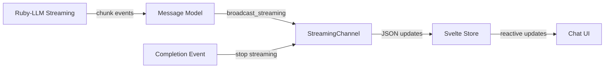
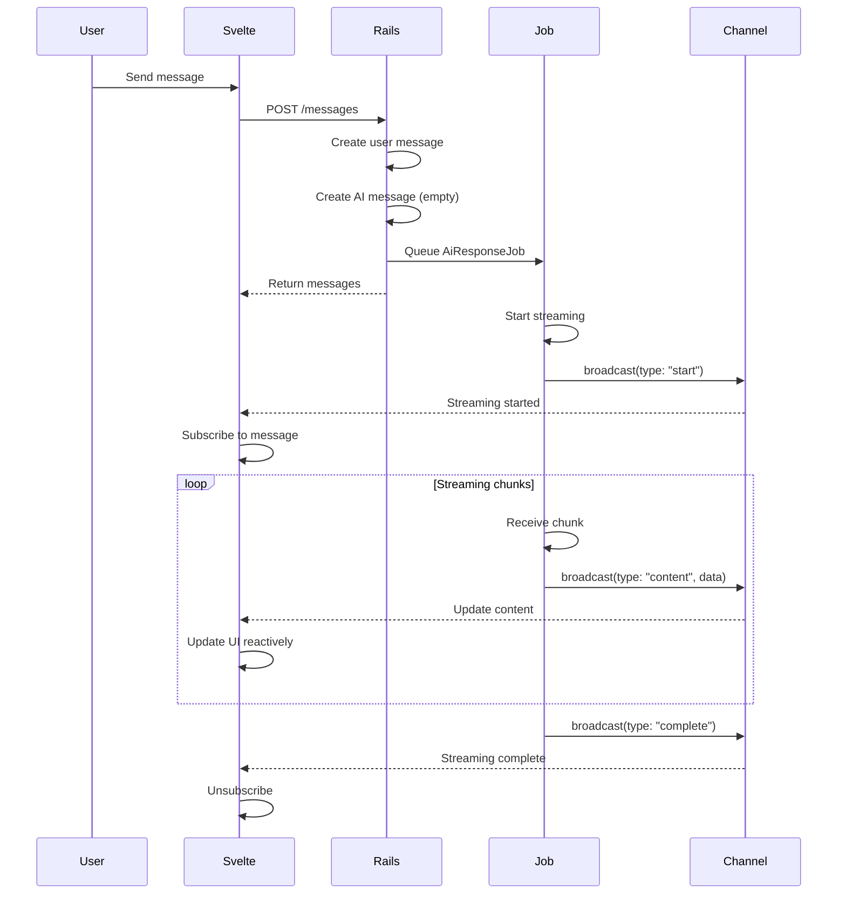
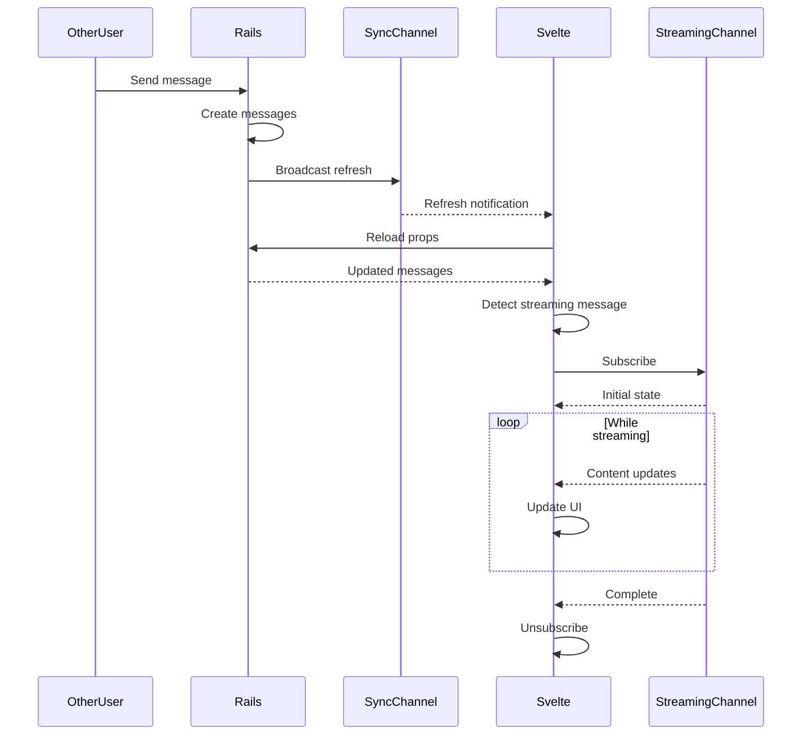

# Technical Specification: Object-Specific Streaming Sync

## Executive Summary

This specification outlines a complementary streaming system to the existing useSync framework, optimized for high-frequency text updates like AI message streaming. While useSync excels at general real-time synchronization by reloading Inertia props, this new system will handle direct JSON updates via ActionCable for specific objects requiring frequent updates (2-3 times per second).

The solution maintains consistency with existing Rails patterns while providing efficient, targeted streaming for AI chat messages without full page prop reloads.

## Architecture Overview

### System Components



### Key Design Decisions

1. **Separate Channel**: New `StreamingChannel` distinct from `SyncChannel` to avoid confusion
2. **Full JSON Updates**: Send complete message JSON (10-20kb) rather than deltas for simplicity
3. **Automatic Lifecycle**: Subscribe on message creation, unsubscribe on completion
4. **Graceful Fallback**: On connection failure, fall back to useSync refresh
5. **Model-Specific**: Only `Message` model supports streaming (can extend later if needed)

## Backend Implementation

### - [ ] 1. Create StreamingChannel

```ruby
# app/channels/streaming_channel.rb
class StreamingChannel < ApplicationCable::Channel
  def subscribed
    return reject unless params[:model] == "Message"
    return reject unless params[:id].present?

    @message = Message.find_by_obfuscated_id(params[:id])
    return reject unless @message

    # Verify authorization through chat association
    return reject unless @message.chat.accessible_by?(current_user)

    # Subscribe to message-specific stream
    stream_from "streaming:Message:#{@message.obfuscated_id}"

    # Send initial state
    transmit({
      type: "initial",
      data: @message.as_json,
      streaming: @message.streaming?
    })
  end

  def unsubscribed
    stop_all_streams
  end
end
```

### - [ ] 2. Create Streamable Concern

```ruby
# app/models/concerns/streamable.rb
module Streamable
  extend ActiveSupport::Concern

  included do
    # Track streaming state
    attr_accessor :streaming_active

    # Skip regular broadcasts while streaming
    before_save :check_streaming_mode
  end

  # Start streaming mode for this object
  def start_streaming!
    @streaming_active = true
    broadcast_streaming_update(type: "start")
  end

  # Send streaming update with full JSON
  def stream_content_update!
    return unless streaming_active?

    broadcast_streaming_update(
      type: "content",
      data: as_json
    )
  end

  # Complete streaming and notify subscribers
  def complete_streaming!
    @streaming_active = false

    broadcast_streaming_update(
      type: "complete",
      data: as_json
    )

    # Re-enable regular broadcasts
    broadcast_refresh if respond_to?(:broadcast_refresh)
  end

  def streaming_active?
    @streaming_active == true
  end

  private

  def broadcast_streaming_update(payload)
    ActionCable.server.broadcast(
      "streaming:#{self.class.name}:#{obfuscated_id}",
      payload
    )
  end

  def check_streaming_mode
    # Skip regular Broadcastable updates while streaming
    self.skip_broadcast = true if streaming_active?
  end
end
```

### - [ ] 3. Update Message Model

```ruby
# app/models/message.rb
class Message < ApplicationRecord
  include Broadcastable
  include Streamable  # Add new concern
  include ObfuscatesId
  include JsonAttributes
  include SyncAuthorizable

  # ... existing code ...

  # Add streaming status tracking
  enum status: {
    pending: 0,
    streaming: 1,
    completed: 2,
    failed: 3
  }

  json_attributes :role, :content_html, :user_name, :user_avatar_url,
                  :completed, :created_at_formatted, :created_at_hour,
                  :streaming  # Add streaming flag to JSON

  def streaming?
    streaming_active? || status == "streaming"
  end

  # Override as_json to include streaming metadata
  def as_json(options = {})
    super(options).merge(
      streaming: streaming?,
      obfuscated_id: obfuscated_id
    )
  end
end
```

### - [ ] 4. Update AI Response Job

```ruby
# app/jobs/ai_response_job.rb
class AiResponseJob < ApplicationJob
  def perform(chat, _user_message)
    ai_message = nil

    chat.on_new_message do
      ai_message = chat.messages.order(:created_at).last
      next unless ai_message

      # Start streaming mode
      ai_message.update!(status: :streaming)
      ai_message.start_streaming!
    end

    chat.on_end_message do |message|
      ai_message ||= chat.messages.order(:created_at).last
      next unless ai_message

      # Complete streaming
      ai_message.complete_streaming!
      finalize_message!(ai_message, message)
    end

    chat.complete do |chunk|
      next unless chunk.content

      ai_message ||= chat.messages.order(:created_at).last
      next unless ai_message

      # Update content without triggering regular broadcasts
      ai_message.update_column(:content, ai_message.content.to_s + chunk.content)

      # Stream the update
      ai_message.stream_content_update!
    end
  rescue StandardError => e
    if ai_message
      ai_message.update!(status: :failed)
      ai_message.complete_streaming!
    end
    raise e
  end

  private

  def finalize_message!(ai_message, ruby_llm_message)
    attributes = {
      content: extract_message_content(ruby_llm_message.content),
      model_id: ruby_llm_message.model_id,
      input_tokens: ruby_llm_message.input_tokens,
      output_tokens: ruby_llm_message.output_tokens,
      status: :completed
    }

    ai_message.update!(attributes.compact)
  end

  # ... rest of existing code ...
end
```

## Frontend Implementation

### - [ ] 5. Create Streaming Store

```javascript
// app/frontend/lib/stores/streaming.js
import { writable, derived } from 'svelte/store';
import { createConsumer } from '@rails/actioncable';

// Check if we're in browser
const browser = typeof window !== 'undefined';
const consumer = browser ? createConsumer() : null;

class StreamingStore {
  constructor() {
    // Map of message_id -> message data
    this.messages = writable(new Map());
    this.subscriptions = new Map();
  }

  // Subscribe to a message's streaming updates
  subscribe(messageId) {
    if (!browser || !consumer) return () => {};

    // Already subscribed?
    if (this.subscriptions.has(messageId)) {
      return () => this.unsubscribe(messageId);
    }

    const subscription = consumer.subscriptions.create(
      {
        channel: 'StreamingChannel',
        model: 'Message',
        id: messageId
      },
      {
        connected: () => {
          console.log(`Streaming connected for message ${messageId}`);
        },

        received: (data) => {
          this.handleStreamingUpdate(messageId, data);
        },

        disconnected: () => {
          console.log(`Streaming disconnected for message ${messageId}`);
          this.handleDisconnection(messageId);
        }
      }
    );

    this.subscriptions.set(messageId, subscription);

    return () => this.unsubscribe(messageId);
  }

  handleStreamingUpdate(messageId, payload) {
    const { type, data, streaming } = payload;

    switch (type) {
      case 'initial':
        // Set initial message state
        this.updateMessage(messageId, data);
        break;

      case 'start':
        // Mark message as streaming
        this.updateMessage(messageId, { streaming: true });
        break;

      case 'content':
        // Update message content
        this.updateMessage(messageId, data);
        break;

      case 'complete':
        // Streaming complete, unsubscribe
        this.updateMessage(messageId, { ...data, streaming: false });
        this.unsubscribe(messageId);
        break;
    }
  }

  handleDisconnection(messageId) {
    // On disconnect, mark for refresh via useSync
    this.updateMessage(messageId, { needs_refresh: true });
    this.unsubscribe(messageId);
  }

  updateMessage(messageId, data) {
    this.messages.update(messages => {
      const current = messages.get(messageId) || {};
      messages.set(messageId, { ...current, ...data });
      return new Map(messages);
    });
  }

  unsubscribe(messageId) {
    const subscription = this.subscriptions.get(messageId);
    if (subscription) {
      subscription.unsubscribe();
      this.subscriptions.delete(messageId);
    }
  }

  // Get reactive message data
  getMessage(messageId) {
    return derived(this.messages, $messages => $messages.get(messageId));
  }

  // Clean up all subscriptions
  destroy() {
    this.subscriptions.forEach(sub => sub.unsubscribe());
    this.subscriptions.clear();
    this.messages.set(new Map());
  }
}

export const streamingStore = new StreamingStore();
```

### - [ ] 6. Create useStreaming Composable

```javascript
// app/frontend/lib/use-streaming.js
import { onMount, onDestroy } from 'svelte';
import { streamingStore } from '$lib/stores/streaming';

/**
 * Hook to manage streaming subscriptions for messages
 *
 * @param {Array} messages - Array of message objects
 * @returns {Object} - Streaming state and methods
 */
export function useStreaming(messages = []) {
  const unsubscribers = [];

  onMount(() => {
    // Subscribe to all streaming messages
    messages.forEach(message => {
      if (message.streaming) {
        const unsub = streamingStore.subscribe(message.obfuscated_id);
        unsubscribers.push(unsub);
      }
    });
  });

  onDestroy(() => {
    unsubscribers.forEach(unsub => unsub());
  });

  // Subscribe to a new message (for when new messages arrive)
  function subscribeToMessage(message) {
    if (message.streaming) {
      const unsub = streamingStore.subscribe(message.obfuscated_id);
      unsubscribers.push(unsub);
    }
  }

  // Get streaming data for a message
  function getStreamingMessage(messageId) {
    return streamingStore.getMessage(messageId);
  }

  return {
    subscribeToMessage,
    getStreamingMessage
  };
}
```

### - [ ] 7. Update Chat Component

```svelte
<!-- app/frontend/pages/chats/show.svelte -->
<script>
  import { page } from '@inertiajs/svelte';
  import { useForm } from '@inertiajs/svelte';
  import { createDynamicSync } from '$lib/use-sync';
  import { useStreaming } from '$lib/use-streaming';
  import { router } from '@inertiajs/svelte';
  // ... other imports ...

  let { chat, chats = [], messages = [], account } = $props();

  // Set up streaming for messages
  const { subscribeToMessage, getStreamingMessage } = useStreaming(messages);

  // Create dynamic sync for regular updates
  const updateSync = createDynamicSync();

  // Track which messages are being streamed
  let streamingMessages = $state(new Map());

  // Set up real-time subscriptions
  $effect(() => {
    const subs = {}
    subs[`Account:${account.id}:chats`] = 'chats';

    if (chat) {
      subs[`Chat:${chat.id}`] = 'chat';
      subs[`Chat:${chat.id}:messages`] = 'messages';
    }

    updateSync(subs);

    // Check for new streaming messages when messages prop updates
    messages.forEach(message => {
      if (message.streaming && !streamingMessages.has(message.obfuscated_id)) {
        // New streaming message detected
        subscribeToMessage(message);
        streamingMessages.set(message.obfuscated_id, true);
      }
    });

    // Check for messages that need refresh (connection dropped)
    messages.forEach(message => {
      const streamingData = getStreamingMessage(message.obfuscated_id);
      if (streamingData?.needs_refresh) {
        // Trigger refresh via useSync
        router.reload({
          only: ['messages'],
          preserveState: true,
          preserveScroll: true,
        });
      }
    });
  });

  // Get display message (streaming or prop version)
  function getDisplayMessage(message) {
    const streamingData = getStreamingMessage(message.obfuscated_id);
    return streamingData || message;
  }

  // ... rest of component ...
</script>

<!-- In the template, use getDisplayMessage for rendering -->
{#each group.messages as message (message.id)}
  {@const displayMessage = getDisplayMessage(message)}
  <div class="space-y-1">
    {#if displayMessage.role === 'user'}
      <!-- User message rendering unchanged -->
    {:else}
      <!-- Assistant message with streaming support -->
      <div class="flex justify-start">
        <div class="max-w-[70%]">
          <Card.Root>
            <Card.Content class="p-4">
              {#if displayMessage.streaming}
                <!-- Show streaming content -->
                <div class="whitespace-pre-wrap break-words">
                  {displayMessage.content || ''}
                  <span class="animate-pulse">▊</span>
                </div>
              {:else if displayMessage.content_html}
                <!-- Completed message with HTML -->
                <div class="prose prose-sm max-w-none">
                  {@html displayMessage.content_html}
                </div>
              {:else}
                <!-- Fallback -->
                <div class="whitespace-pre-wrap break-words">
                  {displayMessage.content || ''}
                </div>
              {/if}
            </Card.Content>
          </Card.Root>
          <!-- Status indicator -->
          <div class="text-xs text-muted-foreground mt-1">
            {formatTime(displayMessage.created_at)}
            {#if displayMessage.streaming}
              <span class="ml-2 text-blue-600 animate-pulse">● Streaming</span>
            {/if}
          </div>
        </div>
      </div>
    {/if}
  </div>
{/each}
```

## Data Flow Diagrams

### Workflow 1: User Sends Message



### Workflow 2: Another User Sends Message



## API Contracts

### StreamingChannel Subscription

```typescript
// Subscription parameters
interface SubscriptionParams {
  channel: 'StreamingChannel';
  model: 'Message';  // Only Message supported initially
  id: string;        // Obfuscated message ID
}

// Message payloads
interface StreamingPayload {
  type: 'initial' | 'start' | 'content' | 'complete';
  data?: MessageJSON;
  streaming?: boolean;
}

interface MessageJSON {
  id: string;
  obfuscated_id: string;
  content: string;
  content_html: string;
  role: 'user' | 'assistant';
  status: 'pending' | 'streaming' | 'completed' | 'failed';
  streaming: boolean;
  created_at: string;
  updated_at: string;
  // ... other message attributes
}
```

### Streamable Concern Interface

```ruby
# Methods added to models including Streamable
module Streamable
  # Start streaming mode
  def start_streaming!

  # Send content update
  def stream_content_update!

  # Complete streaming
  def complete_streaming!

  # Check if currently streaming
  def streaming_active?
end
```

## Migration Strategy

### Phase 1: Infrastructure (Week 1)
- [ ] Implement StreamingChannel
- [ ] Create Streamable concern
- [ ] Update Message model
- [ ] Deploy and test channel connectivity

### Phase 2: Backend Integration (Week 1)
- [ ] Update AiResponseJob for streaming
- [ ] Add status enum to messages
- [ ] Test streaming flow end-to-end

### Phase 3: Frontend Integration (Week 2)
- [ ] Implement streaming store
- [ ] Create useStreaming composable
- [ ] Update chat component
- [ ] Test with multiple concurrent chats

### Phase 4: Polish & Optimization (Week 2)
- [ ] Add connection recovery logic
- [ ] Implement batching for very fast updates
- [ ] Add streaming indicators to UI
- [ ] Performance testing

## Performance Considerations

### Limitations
- **Message Size**: Full JSON ~10-20kb per update
- **Frequency**: 2-3 updates per second per message
- **Concurrent Streams**: Designed for 5-10 concurrent streams per user
- **Network**: Requires stable WebSocket connection

### Optimizations
1. **Debouncing**: Frontend already debounces at 50ms minimum
2. **Compression**: ActionCable compression enabled by default
3. **Cleanup**: Automatic unsubscription on completion
4. **Memory**: Streaming store only holds active messages

### Future Optimizations (if needed)
- Delta updates instead of full JSON
- Binary protocol for content updates
- Server-side buffering for batched updates
- CDN edge streaming for global users

## Testing Strategy

### Unit Tests

```ruby
# test/models/concerns/streamable_test.rb
class StreamableTest < ActiveSupport::TestCase
  test "starts and completes streaming" do
    message = create(:message)

    assert_not message.streaming_active?

    message.start_streaming!
    assert message.streaming_active?

    message.complete_streaming!
    assert_not message.streaming_active?
  end

  test "broadcasts streaming updates" do
    message = create(:message)

    assert_broadcast_on("streaming:Message:#{message.obfuscated_id}",
                       type: "content") do
      message.stream_content_update!
    end
  end
end
```

### Integration Tests

```ruby
# test/channels/streaming_channel_test.rb
class StreamingChannelTest < ActionCable::Channel::TestCase
  test "rejects unauthorized subscriptions" do
    other_message = create(:message)

    subscribe model: "Message", id: other_message.obfuscated_id
    assert subscription.rejected?
  end

  test "streams updates to authorized users" do
    message = create(:message, chat: @user_chat)
    stub_connection current_user: @user

    subscribe model: "Message", id: message.obfuscated_id
    assert subscription.confirmed?

    message.stream_content_update!
    assert_broadcast_on(subscription, type: "content")
  end
end
```

### Frontend Tests

```javascript
// test/frontend/streaming.test.js
import { describe, it, expect } from 'vitest';
import { streamingStore } from '$lib/stores/streaming';

describe('StreamingStore', () => {
  it('updates message on streaming events', () => {
    const messageId = 'msg_123';

    streamingStore.handleStreamingUpdate(messageId, {
      type: 'content',
      data: { content: 'Hello world' }
    });

    const message = get(streamingStore.getMessage(messageId));
    expect(message.content).toBe('Hello world');
  });

  it('unsubscribes on completion', () => {
    const messageId = 'msg_123';
    streamingStore.subscribe(messageId);

    streamingStore.handleStreamingUpdate(messageId, {
      type: 'complete',
      data: { streaming: false }
    });

    expect(streamingStore.subscriptions.has(messageId)).toBe(false);
  });
});
```

## Edge Cases & Error Handling

### Connection Loss
- Frontend detects disconnection
- Sets `needs_refresh` flag
- Triggers full reload via useSync
- Resubscribes to streaming messages after reload

### Message Creation Race Condition
- User message created synchronously
- AI message created before job starts
- Streaming subscription happens after message exists
- Initial state sent on subscription

### Multiple Tabs
- Each tab maintains own subscriptions
- ActionCable handles multiple connections
- No interference between tabs

### Job Failure
- Job catches exceptions
- Sets message status to 'failed'
- Calls `complete_streaming!` to clean up
- Frontend shows retry button

## Security Considerations

### Authorization
- Channel verifies access through chat association
- No direct message access without chat access
- Obfuscated IDs prevent enumeration
- Authorization checked only on subscription (not each update)

### Data Validation
- Full message JSON validated on backend
- Frontend treats all data as untrusted
- HTML content pre-rendered on backend
- No client-side markdown processing

## Conclusion

This streaming sync system provides an elegant, efficient solution for high-frequency message updates while maintaining consistency with existing Rails patterns. It complements the useSync framework perfectly - useSync handles general synchronization while streaming handles intensive real-time updates.

The implementation follows Rails conventions, reuses existing authorization patterns, and provides a smooth developer experience with minimal boilerplate. The graceful fallback ensures reliability even with connection issues.

Total implementation effort: ~2 weeks for full production deployment.